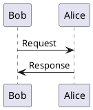

## 細かい話
### 入力ファイルのエンコーディングと改行スタイル

　入力となる Markdown ファイルのエンコーディングは utf-8 のみですが、改行コードは Lf のみでも 
CrLf でも動作します。ただし、Lf の方がほんの少し高速になります（誤差程度でしょうけど）。

### 文字装飾やリンクの制約と継続行

　リスト要素や文章中に記述できる各種の装飾、リンクなどは、行を跨ぐことはできないので
注意してください。単一の行に記述しなければならない記法を複数行に跨がらせたい場合、
行末にスペース、バックスラッシュを順に記述することにより行の継続をさせることができます。
この継続行の扱いは preブロックの内部では行なわれません。

### 内部的な処理順序

　turnup に様々な機能が追加された結果、当初は 1-pass だった内部処理も複雑になっていきました。
現在では、以下の内部ステップを実行しています。

| step |  action         | description        |
|:----:|:================|:-------------------|
|  1   | 入力データのロード | 指定された入力ファイルとその中の include 指令を再帰的に処理して単一の行シーケンスを \
生成し、スニペットの展開も行ないます。また、この時点で改行コードの統一を済ませてしまいます。 |
|  2   | プリプロセス      | 入力データの行シーケンスを反復し、変数定義の追跡、および変数展開を実施します。 \
また、条件分岐の処理もこの時点で実施し、最後に継続行の連結処理をします。 |
|  3   | 予備スキャン      | 変数展開済みの行シーケンスを反復し、見出しや図表タイトル、用語定義などを解析して各種の \
拡張機能の利用に備えます。 |
|  4   | 出力生成         | 行シーケンスを反復し、出力 HTML を生成します。 |

### 一部の文字装飾における制約

　以下の文字装飾において対象範囲を括る（**などの文字列の）ペアのすぐ外側には、__「空白類文字でない \
文字があってはいけません」__。また、ペアのすぐ内側には __「空白類文字があってはいけません」__。

* [$$](#強調)
* [$$](#取消し線)
* [$$](#マーカー)
* [$$](#コード)

　version 0.849 の変更において、__「ペアの外側は空白類文字でなく括弧類または句読点でも良い」__ と
されました。

### フィルタ機能について

　turnup が標準で提供するフィルタ機能は簡易的なもので、せいぜいコメントと文字列
リテラルなどを優先して処理し、あとはキーワードをハイライトする程度です。構文解析などを伴う
リッチなコードハイライトが必要な場合、[外部フィルタの利用](#外部フィルタの登録)を検討して
ください。

### 領域の折り畳みについて
<!-- autolink: [detailsタグ](#領域の折り畳みについて) -->

　[$$](#領域の折り畳み)を可能にする拡張は、スクリプトを使わず、<details> タグを使って
実現しています。ひょっとしたら、古いブラウザでは動作しないかもしれません。あと、折り畳まれる
対象の中で[$$](#脚注)を使った場合、畳まれた状態では脚注からのリンクをクリックしてもジャンプ
しないことがわかっていますので注意してください。

### 外部フィルタにおける一時ファイル名について

　[$$](#外部フィルタの登録) では、入出力ファイル名として `%in` および `%out` という
プレースホルダを使用します。実際に使用されるファイル名は、turnup が都度決定すると
説明していましたが、ここではその詳細について説明します。

　外部フィルタの実行において使用する入出力ファイル名には、フィルタに渡すデータを元に作成
したハッシュコードが使用されます。これにより、「同じデータであれば同じファイル名になる」
ことが保証されます。このことを利用して、コストのかかる外部フィルタ実行についてはその出力
をキャッシュしておく、といった措置が可能になります（具体的な方法については、[$@ 節](#PlantUML)
などを参照してください）。

### 作図まですべてテキストで実現する方法

　文書のテキスト管理を徹底しようとすると、ダイアグラムやグラフなどの視覚的な要素が問題に
なります。アスキーアートは誰もが好きなわけではありませんし、メンテナンスし易いわけでも
ありません{{fn:アスキーアートと使うなと言ってるんじゃないですよ。}}。他の方法で作図を
し、画像ファイルに変換して[貼り付ける](#画像の挿入)こともできますが、それをやった時点
で図はテキスト管理から漏れ出してしまいます。ここでは、作図まで全てテキストで頑張るため
の方法を紹介します。

#### PlantUML
<!-- autolink: [$$](#PlantUML) -->

　UML を書きたければ、PlantUML{{fn:[](https://plantuml.com/)}} が現実的な選択肢に
なります。ダイアグラムの定義はテキストで書くことができますし、出力として SVG 形式を選択
すればテキスト形式で turnup の出力 HTML に埋め込むことができます。PlantUML の詳細
については割愛しますが、PlantUML の jar が turnup のデータディレクトリと同じ場所
にあるなら、外部フィルタの定義は以下のようになるでしょう。

```markdown
<​!-- filter:plantuml = cat %in | java -jar ./plantuml.jar -pipe -tsvg > %out -->
```

　これで、外部フィルタ `plantuml` が使えるようになります。PlantUML 公式サイトの例を借り
るなら、以下のように記述すれば、

~~~markdown

~~~

　以下のように埋め込みが行なわれます。図中のテキストも選択・コピーなどが可能であることにご注目。

<!-- MEMO :
  このマニュアル自体は PlantUML が導入されていない環境でも生成できるように、
  別途生成した SVG 形式画像を埋め込んでいます。
-->

```raw
<div align='center'>
<!-- include: plantuml.sample.svg -->
</div>
```


${BLANK_PARAGRAPH}

　PlantUML のちょっとだけ残念な点は、Java ベースで動作が緩慢なことです。そのため、大量
の UML ダイアグラムを含む文書を turnup にかける場合、無条件に全ダイアグラムを生成
すると非常に時間がかかります。そこで、[一時ファイル名の規則](#外部フィルタにおける一時ファイル名について)
を利用して PlantUML の出力をキャッシュしましょう。以下のようなスクリプトを作成して、

<!-- expand-variable:push disable -->

```sh
#!bin/bash

IN=$1
OUT=$2
CACHE=.cache
JAR=./plantuml.jar
OPT=-Dfile.encoding=UTF-8

if [ ! -e ./${CACHE} ]; then
    mkdir ${CACHE}
fi

if [ -e ./${CACHE}/${OUT}.svg ]; then
    touch ./${CACHE}/${OUT}.svg
else
    cat ${IN} | java ${OPT} -jar ${JAR} -pipe -tsvg >> ./${CACHE}/${OUT}.svg
fi

echo "<div align='center'>"  > ./${OUT}
cat ./${CACHE}/${OUT}.svg   >> ./${OUT}
echo "</div>"               >> ./${OUT}
```

<!-- expand-variable:pop -->

外部フィルタの定義で使うようにします。これで、.cache というディレクトリに PlantUML の
出力ファイルがキャッシュされるようになり、turnup の実行時間が改善されます。

```markdown
<!​-- filter:plantuml = bash ./plantuml.sh %in %out -->
```

${BLANK_PARAGRAPH}

#### gnuplot
<!-- autolink: [$$](#gnuplot) -->

　グラフを描画したければ、ひとまずは gnuplot が選択肢になります。[PlantUML の場合](#PlantUML)
同様に出力をキャッシュする前提でスクリプトを置くならば、外部フィルタ定義は以下のようになるでしょう。

```markdown
<!​-- filter:gnuplot = bash ./gnuplot.sh %in %out -->
```

　このスクリプトの内容は後回しにするとして、gnuplot はコマンドファイルとデータを個別に用意する
必要があるので、以下のようにハイフンだけの行をセパレータにして両方記述するようにします。前半の
コマンド部分では入出力ファイルを `in_file, out_file` としていますが、これはスクリプトでどうにか
します。

~~~markdown
```gnuplot
set datafile separator ","
set terminal svg size 500,300 fixed
set output out_file
plot in_file using 1:2 with lines notitle, in_file using 1:3 with lines notitle
------------------------------------------------------------------------
0,0,0
1,32,1
2,64,4
   :
   :
38,1216,1444
39,1248,1521
40,1280,1600
```
~~~

　これで、以下のような SVG 画像が埋め込まれます。

<!-- MEMO :
  このマニュアル自体は gnuplot が導入されていない環境でも生成できるように、
  別途生成した SVG 形式画像を埋め込んでいます。
-->

```raw
<div align='center'>
<!-- include: gnuplot.sample.svg -->
</div>
```

${BLANK_PARAGRAPH}

　最後に、スクリプトの内容を以下に示します。セパレータ行の前後を一時ファイルに振り分けること、
入出力ファイルをコマンドファイル冒頭に書き込むことなどがポイントです。なお、エラー処理などは
不十分な状態です。

<!-- collapse:close -->
gnuplot.sh の内容はこちら

<!-- expand-variable:push disable -->

```sh
#!/bin/bash

IN=$1
OUT=$2
CACHE=.cache
APP=gnuplot

if [ ! -e ./${CACHE} ]; then
    mkdir ${CACHE}
fi

if [ -e ./${CACHE}/${OUT}.svg ]; then
    touch ./${CACHE}/${OUT}.svg
else
    LINENUM=`grep -n '^-\+$' ${IN} | perl -pe 's/^(\d):-+$/\1/'`
    LINECNT=`cat ${IN} | wc -l`
    if [ ! -z "${LINENUM}" ]; then
        echo "in_file=\"${IN}.dat\"" > ${IN}.gp
        echo "out_file=\"./${CACHE}/${OUT}.svg\"" >> ${IN}.gp
        head -$((LINENUM - 1)) ${IN} >> ${IN}.gp
        tail -$((LINECNT - LINENUM)) $IN > ${IN}.dat
        $APP ${IN}.gp
        rm ${IN}.gp
        rm ${IN}.dat
    fi
fi

echo "<div align='center'>"  > ./${OUT}
cat ./${CACHE}/${OUT}.svg   >> ./${OUT}
echo "</div>"               >> ./${OUT}
```

<!-- expand-variable:pop -->

<!-- collapse:end -->

### 画像ファイルを HTML 内に取り込む方法

<!-- collapse:close -->
※ version 0.839 で[画像埋込みがサポート](#画像モード)されたため、この項目は不要となりました。折り畳んで遺しておきます。


　[前節](#作図まですべてテキストで実現する方法)ではテキストで作図をする方法をいくつか紹介
しましたが、ここでは png 形式などの画像ファイルを出力 HTML ファイル内に埋め込む方法を
紹介します{{fn:turnup が「全部テキストで」なんとかしようとしているのには理由が２つあります。１つめは git などの \
バージョン管理システムでの管理を容易にすることで、２つめは「出力としてのドキュメントも単一にしたい」というものです。}}。

　[前節](#作図まですべてテキストで実現する方法)と同じように、外部フィルタを定義します（内容
については後述）。

```markdown
<!​-- filter:embed_image = bash ./embed_image.sh %in %out -->
```

　この外部フィルタは以下のように使用します。つまり、埋め込みたいファイル名を指定します。

~~~markdown
```embed_image
./tmp.png
```
~~~

　これによって、以下のような内容が埋め込まれます。

```html
<div align='center'>
  
</div>
```

${BLANK_PARAGRAPH}

　最後に、スクリプトの内容を以下に示します。このスクリプトについては、以下の点に注意してください。

* MIME タイプの `image/` に後続する部分はファイルの拡張子から取っています。
* base64 を使うため、元の画像ファイルの 4/3 倍のサイズのテキストを埋め込むことになります。

<!-- expand-variable:push disable -->

```sh
#!/bin/bash

IN=$1
OUT=$2
CACHE=.cache

if [ ! -e ./${CACHE} ]; then
    mkdir ${CACHE}
fi

if [ -e ./${CACHE}/${OUT}.dat ]; then
    touch ./${CACHE}/${OUT}.dat
else
    FILE=`cat "${IN}"`
    TYPE=`echo ${FILE} | perl -pe "s/^.+\.(.+)$/\1/"`
    echo -n " ./${CACHE}/${OUT}.dat
    base64 ${FILE} >> ./${CACHE}/${OUT}.dat
    echo "' />"  >> ./${CACHE}/${OUT}.dat
fi

echo "<div align='center'>"  > ./${OUT}
cat ./${CACHE}/${OUT}.dat   >> ./${OUT}
echo "</div>"               >> ./${OUT}
```

<!-- expand-variable:pop -->

<!-- collapse:end -->

### 自動リンクと文字装飾の優先順位について

　基本的なルールは次の通りです。

* [自動リンク](#キーワードへの自動リンク) は文字装飾がすべて処理された後に適用される

　この仕様は、 **「文書内の別の場所での自動リンク対象文字列の増減によって文字装飾の結果が変わってはならない」**
という原則からきています。このことは、定義リストや autolink のタイトルに文字装飾と判定されるような記述は
できないことを意味しますので注意してください。

### リンクターゲット名の重複に関するチェック仕様

　version 0.845 において、リンクターゲット名の重複チェックに関する仕様が緩和されました。
ここでリンクターゲット名とは、名前でリンクを作成できる以下のものを指します。

* [$$](#見出し)
* [$$](#図と表のタイトル)
* [$$](#アンカー)
* [$$](#定義リスト)
* [$$](#キーワードへの自動リンク)

　以前は、名前の重複が発見された時点で全てエラーとする仕様でしたが、version 0.845 での変更
により、「名前が重複していても実際にリンク先として参照されない限りエラーとしない」という仕様
になりました。

　同時に、起動オプションとして `--warning` が追加されました。これを指定すると、リンクターゲット
名の重複に対して（それがリンク先として参照されていなくても）警告を出すようになります。

　ただし、[目次](#目次の生成)や[図表一覧](#図表一覧の生成)、[索引](#索引の生成)の生成を利用
する場合、これらもリンク先の参照をするため注意が必要です。

