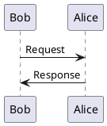

<!-- define: APPNAME = turnup -->
<!-- define: BLANK_PARAGRAPH = '　　' -->

<!-- title:${APPNAME} readme -->    
<!-- style:./default.css -->			
<!-- <!-- config:term-link-in-header -->

<!-- <!-- config:write-comment -->			
<!-- config:header-numbering 2 4 -->			

# README - ${APPNAME}

　この文書は、 **${APPNAME}** のマニュアル文書です。

## Table of contents

<!-- embed:toc-x 2 4 -->

${BLANK_PARAGRAPH}

## ${APPNAME} とは

　${APPNAME} は、Markdown 書法で作成したテキストファイルから HTML を出力するツールです
{{fn:${APPNAME}という名前は、mark down を mark up にひっくり返す(turn upする)という意味で付けられました。}}。
このマニュアル文書自体、${APPNAME} で作成されています。

　${APPNAME} の目的は、 **「マニュアルや技術文書、設計文書などをテキストベースで作成・管理できるように \
すること」** です。git のようなバージョン管理システムが普及した現在でも、これらの文書作成に
バイナリ形式のファイルを使用している限り、文書の管理には困難が伴います。手軽にテキストで文書
作成ができるツールとして markdown 書法がありますが、markdown に対応した従来のツールは本家
{{fn:[](https://daringfireball.net/projects/markdown/)}}を始めとして、全体的に機能
不足でした。${APPNAME} はこの不足を埋めることを目的としているため、[$$](#脚注)や[目次](#目次の生成)・
[図表一覧](#図表一覧の生成)の生成、[$$](#見出しの自動ナンバリング)などの拡張機能を用意して
います。

　${APPNAME} は、ワープロソフトそのものを置き換えようとしているわけではありません。最終的に
印刷して頒布することが想定されるような文書では、ワープロソフトやもっと高品質な出力が可能な組版
ソフトを使用した方が良いでしょう。

## 用語

*[GFM]: GitHub Flavored Markdown というものの略語だそうです。${APPNAME} は可能な範囲で
サポートするように心掛けています。

*[HTML]: Hyper text markup language の略語です。

*[空白類文字]: スペース文字、タブ文字を意味します。いわゆる全角スペース文字も含みます。

## 使い方

　入力となるファイルの名前をパラメータとして起動してください。生成された HTML は標準出力
に書き出されるので、必要に応じてリダイレクトしてください。

~~~
  ${APPNAME}  input.md  >  output.html
~~~

　入出力ファイルのエンコーディングは utf-8 で固定となっています。それ以外のエンコーディング
への対応は現状では予定されていません。[$$](#細かい話)も参照してください。

## 記法

　${APPNAME} の入力書式は一般的な Markdown 書法と基本的に同じですが、いくつかの拡張機能
{{fn: `GitHub Flavored Markdown` とか色々あるみたいで、何が標準なのか良くわかりませんが。}}
を備えています。

### 見出し

　行頭から１〜６個の # を記述し、続けて（半角）スペースをひとつ書いた行は見出し行になります。
後続する文字列が見出しのタイトルとなります。# の数に応じて h1 〜 h6 になります。

~~~
 # header1
 ## header2
 ### header3
 #### header4
 ##### header5
 ###### header6
~~~

　拡張機能により、[見出しに番号を自動付与](#見出しの自動ナンバリング)したり、
[見出しから目次を生成](#目次の生成)したりできます。

### 箇条書きリスト

　-（ハイフン）、+（プラス）、または *（アスタリスク）にスペース（またはタブ）を後続させると、
箇条書きリストになります。ネストさせたい場合は、行頭にタブ文字または（4文字までの）スペースを
使用してください。

<!-- snippet: DOT-LIST-SAMPLE-1
- List A
+ List B
    * List B - 1
    - List B - 2
        + List B - 2 - 1
        * List B - 2 - 2
    + List B - 3
- List C
-->

~~~
<!-- expand: DOT-LIST-SAMPLE-1 -->
~~~

　上記は、以下のように出力されます。

<!-- expand: DOT-LIST-SAMPLE-1 -->

#### リスト要素における改行

　一般的な markdown 書法同様、リストの要素は改行を利用して多くの情報をぶらさげることが
できます。（正直面倒なので）細かい説明は省略しますが、以下に例を示します。

<!-- snippet: DOT-LIST-SAMPLE-2
-   blah blah 
    blah blah 
    blah blah 
- blah blah 
blah blah 

  next paragraph : blah blah 
blah blah blah blah blah

- list item with blockquote
    > blah blah blah 
    > blah blah blah 
    > blah blah blah 
- list item with code
    - c code
        ```c
          int main( void ) {
              return 0;
          }
        ```
    - lisp code
        ```lisp
          (defun factorial (n)
            (labels ((impl (x acc)
                       (if (<= x 1)
                           acc
                           (impl (1- x) (* acc x)))))
              (impl n 1)))
        ```
-->

~~~
<!-- expand: DOT-LIST-SAMPLE-2 -->
~~~

　上記は、以下のように出力されます。

<!-- expand: DOT-LIST-SAMPLE-2 -->

#### チェックボックス付きのリスト

　また、- などの先頭記号とスペースに続けて [ ] や [X] を記述すると、チェックボックス付きリストになります。
実際には X だけでなく、O や V、それらの小文字でも大丈夫です。

<!-- snippet: DOT-LIST-SAMPLE-3
- Task list
    - [X] completed task
        * point 1
        * point 2
    - [ ] not completed task
-->

~~~
<!-- expand: DOT-LIST-SAMPLE-3 -->
~~~

　上記は、以下のように出力されます。

<!-- expand: DOT-LIST-SAMPLE-3 -->


　このチェックボックス付きリストについては１点だけ注意点があります。それはチェックボックスを使う場合、
スタイルスタックが適用されなくなるということです。

### 番号付きリスト

　数字にピリオドとスペースを後続させると、番号付きリストになります。ネストさせたい場合は、行頭に
タブ文字または（4文字までの）スペースを使用してください。

<!-- snippet: NUM-LIST-SAMPLE-1
1. List A
1. List B
    1. List B - 1
    1. List B - 2
        1. List B - 2 - 1
1. List C
-->

~~~
<!-- expand: NUM-LIST-SAMPLE-1 -->
~~~

　上記は、以下のように出力されます。改行を使用してリスト要素に情報をぶらさげられるのは箇条書き
リストと同様です。ただし、番号付きリストではチェックボックスの利用はできません。

<!-- expand: NUM-LIST-SAMPLE-1 -->

### preブロック

<!-- autolink: [preブロック](#preブロック) -->

　バッククォート3つ、またはチルダ3つだけからなる行で囲まれたブロックは `<pre>` ブロックとなります。
{{fn:スペースまたはタブで始まる行を pre ブロックとする仕様は採用していません}}

<!-- snippet: PRE-SAMPLE
int main( void ) {
    std::cout << "hello world." << std::endl;
    return 0;
}
-->

```
~~~
<!-- expand: PRE-SAMPLE -->
~~~
```

　上記は、以下のように出力されます。

~~~
<!-- expand: PRE-SAMPLE -->
~~~

　拡張機能として、preブロックを開始する行に言語などの名前をつけることでコードハイライトをする
機能もあります。これについての詳細は[](#フィルタ機能)を参照してください。


### テーブル

<!-- autolink: [テーブル](#テーブル) -->

　以下のような記述でテーブルを作成できます。この場合、１行目は常にヘッダ行（th タグ）であり、
２行目以降がデータ行（td タグ）になります。

<!-- snippet: TABLE-SAMPLE-1
| header A | header B | header C |	
|     0    |     1    |    2     |	
|     3    |     4    |    5     |	
|     6    |     7    |    8     |	
-->

~~~
<!-- expand: TABLE-SAMPLE-1 -->
~~~

　上記は、以下のようになります。この場合、各列のデータはすべて左寄せになります。

<!-- expand: TABLE-SAMPLE-1 -->


　列毎に中央揃え、右寄せなどのアライメント指定を指定をしたい場合には、２行目に :---: や ---: を
記述します。

<!-- snippet: TABLE-SAMPLE-2
| header A | header B | header C |	
| :------- | :------: | -------: |	
|     0    |     1    |    2     |	
|     3    |     4    |    5     |	
|     6    |     7    |    8     |	
-->

~~~
<!-- expand: TABLE-SAMPLE-2 -->
~~~

　上記は、以下のように出力されます（表はデフォルトでセンタリングされます）。

<!-- expand: TABLE-SAMPLE-2 -->


　拡張機能として、２行目に記述する :---: や ---: では、- のかわりに = を使用することが
できます。 `:====:` などとした場合、その列は nowrap 指定が追加され、
__「自動的な折り返しを禁止」__ することができます
{{fn:= と - を混在させた場合、従来通り nowrap ではないものとみなされます。}}。

　さらに、:---: や ---: の行は２行目よりも後ろに書くことができます。それにより、複数行に
渡るヘッダ行を記述することができます。以下のように。

<!-- snippet: TABLE-SAMPLE-3
|     A    |     B    |    C     |	
|   Alpha  |   Bravo  |  Charlie |	
| :------- | :------: | -------: |	
|     0    |     1    |    2     |	
|     3    |     4    |    5     |	
|     6    |     7    |    8     |	
-->

~~~
<!-- expand: TABLE-SAMPLE-3 -->
~~~

　上記は、以下のように出力されます。

<!-- expand: TABLE-SAMPLE-3 -->


　別の拡張として、セル結合がサポートされています。セルを開始する | の直後に N> （ここで N は数値）を
指定することで、セルを横方向に N 列結合させることができます。同様に、N^ とすることでセルを縦方向に N 列
結合させることができます{{fn:[$$](#スタイルパレット) の指定も含め、複数の指定を同時にする場合、  \
`|N]M>U^` の順序で指定してください。}}。以下に例を示します。

<!-- snippet: TABLE-SAMPLE-4
|2>      A & B        |2^ C<br>Charlie |	
|   Alpha  |   Bravo  |
| :------- | :------: | -------: |	
|     0    |     1    |    2     |	
|     3    |     4    |    5     |	
|     6    |     7    |    8     |	
-->

~~~
<!-- expand: TABLE-SAMPLE-4 -->
~~~

　上記は、以下のように出力されます。

<!-- expand: TABLE-SAMPLE-4 -->


${BLANK_PARAGRAPH}


　アライメント指定行は複数記述できるようになりました。最初のアライメント指定行がヘッダとデータの境界となる
のは従来通りで、アライメント指定は次のアライメント指定行が登場するまでの間有効となります。これにより、
[セル結合とアライメント指定を併用した場合の問題](#【解決済】テーブルで colspan/rowspan を使うとアライメント \
指定がずれる)に対処することができます。以下に例を示します。

<!-- snippet: TABLE-SAMPLE-5
| column A | column B | column C |
|:---------|:--------:|---------:|
|left      |center    |right     |
|:--------------------|---------:|
|2> left              |right?    |
|:---------|:--------:|---------:|
|left      |center    |right     |
-->

```
<!-- expand: TABLE-SAMPLE-5 -->
```

　上記は、以下のようになります。

<!-- expand: TABLE-SAMPLE-5 -->


${BLANK_PARAGRAPH} 

　version 0.815 より、内部フィルタを使って CSV 形式などのデータからテーブルを生
成できるようになりました。この拡張機能については「[](#テーブルの生成)」を参照して
ください。

### 引用

　> で始まる行は引用になります。連続する引用のブロックは `<blockquote>` タグで括られ、通常の各種
書法に従って処理されます。これはネストさせることができます。

<!-- snippet: CITATION-SAMPLE
>  blah blah blah blah blah blah 
> blah blah blah blah blah blah 
>
> * foo
>     * bar
>     * quux
>
>> blah blah blah blah blah blah 
>> blah blah blah blah blah blah 
>
> block-quoted code
>
> ```C++
>   int main( void ){
>       std::cout << "hello world." << std::endl;
>       return 0;
>   }
> ```
>
-->

~~~
<!-- expand: CITATION-SAMPLE -->
~~~

　上記は、以下のように出力されます。

<!-- expand: CITATION-SAMPLE -->

### 定義リスト

　以下のような記述により、定義リストを作成できます。${APPNAME} では、これによって定義された
用語は[自動リンク](#キーワードへの自動リンク)の対象となります。

~~~
  *[用語]: 用語の定義をここに記述します。
  複数行に渡る定義も記述できます。空行で終わります。

~~~

　上記は、以下のように出力されます。

```raw
<dl>
  <dt>用語</dt>
  <dd>用語の定義をここに記述します。複数行に渡る定義も記述できます。空行で終わります。</dd>
</dl>
```

　[ と ] に囲まれた用語は、前後のスペースは無視されますが、途中にあるスペースは用語の一部とみなされます。


### コメント

　${APPNAME} は、以下のような HTML 形式のコメントをコメントとして扱います。つまり、出力
される HTML の内容には含まれません。

```raw
<pre>
  &lt;!-- comment --&gt;

  &lt;!--
    multi
    line
    comment
  --&gt;
</pre>
```

　ただし、この挙動は変更することができます。[write-comment設定](#コメントの出力)を参照して
ください。


### 強調

　1 〜 3 個の連続するアスタリスクまたはアンダースコアで括ることにより、文字列を強調することが
できます。どのように表示されるのかは、スタイルシート次第です。

* １つだと、em タグによる強調になります。 `*これ*` が、 *これ* になります。
* ２つだと、strong タグによる強調になります。 `**これ**` が、 **これ** になります。
* ３つだと、em と strong の併用になります。 `***これ***` が、 ***これ*** になります。


　この書法が適用されるルールには、少し細かい規則があります。[](#一部の文字装飾における制約)を
参照してください。


### 取消し線

　２つのチルダ ~~ で括ることで、文字列に取消線を引くことができます。
`~~この部分は取消し~~` が、 ~~この部分は取消し~~ になります。

　この書法が適用されるルールには、少し細かい規則があります。[](#一部の文字装飾における制約)を
参照してください。


### マーカー

　== を使って括ることで、マーカーを利用することができます。
スタイルシート次第ですが、 `==例えばこんなふう==` が、 ==例えばこんなふう== になります。

　この書法が適用されるルールには、少し細かい規則があります。[](#一部の文字装飾における制約)を
参照してください。


### 上付きと下付き

　単一の ^ および ~ で括ると、文字列を上付きと下付きにできます。
たとえば `H~2~O` は H~2~O に、 `2^10^ = 1024` は 2^10^ = 1024 になります。


### リンク

　文章中で以下のような書き方をすることで、URL へのリンクを貼ることができます。
{{fn:GFM だと URL を単純に書いただけでもリンクになるようですが、そこまではしてません。}}

```
  [テキスト](URL)
```

　たとえば、 `[Google](https://www.google.co.jp/)` は [Google](https://www.google.co.jp/) と
なります。テキスト部分を省略すると、URL がそのまま表示されます。つまり、
`[](https://www.google.co.jp/)` は [](https://www.google.co.jp/) となります。

　拡張機能として、ページ内の見出しや図表タイトルへのリンクを作成することもできます。[$@ 節](#ページ内へのリンク)
を参照してください。


### コード

　文章中では、以下のようにバッククォートで括ることで、囲まれた部分をコードとして表示させられます。
この内部にある文字列は、[自動リンク](#キーワードへの自動リンク)やその他の文字装飾は実行されません。

~~~
  `code`
~~~

　この書法が適用されるルールには、少し細かい規則があります。[](#一部の文字装飾における制約)を
参照してください。

### 水平線

　行頭からハイフン、等号、アンダースコア、アスタリスクを３個以上を記述すると水平線として出力
されます。文字種は混在させないでください。

### 画像の挿入

　画像を表示させるには、以下のように記述します。独立した行として記述することもできますし、
文章中にインラインで挿入させることもできます。

~~~
  
~~~

　上記は、以下のように展開されます。なお、代替テキストは省略できます。

~~~
  
~~~

### 改行の挿入

　文中で改行させるには、HTML タグ `<br>` をそのまま書きます。


### 段落

　拡張機能を含め、他の書法と認識されない行はすべて段落の開始とみなされます。
段落は空行または[$$](#コメント)行に至るまでのすべての行が連結され、単一の
段落として出力されます。

${BLANK_PARAGRAPH}

## 拡張機能

<!-- autolink: [$$](#拡張機能) -->

　${APPNAME} には、いくつかの拡張機能があります。一般的な Markdown の書法からは逸脱しますが、
文書作成に必要と判断して追加しているものです。

### 文書タイトルとスタイルシートの指定

　データファイルの冒頭に以下のようなコメントを記述することで、出力される HTML ファイルのヘッダに
設定するタイトルとスタイルシートを指定することができます。

~~~
  <!-- title:Document title -->
  <!-- style:./default.css -->
~~~

　このうち、スタイルシートの指定は設定の影響を受けます。詳細は
[embed-stylesheet設定](#スタイルシートの埋め込み)を参照してください。

### 図と表のタイトル

　図と表には、専用のタイトルをつけることができます。図（大抵は画像を表示させるという意味ですが）の
場合、以下のように行頭に `Figure.` を、それに続いてタイトルを書きます。

~~~

Figure. title of figure
~~~

　表の場合は行頭に `Table.` を、それに続いてタイトルを書きます。

~~~
Table. title of table
| header1 | header2 |
| :------ | :-----: |
|    0    |    1    |
|    2    |    3    |
~~~

　この方法でタイトルをつけておけば、同じく拡張機能の[図表一覧の生成](#図表一覧の生成)機能で一覧を
生成することができます。

　見出しと同様に、図表のタイトルには自動的に番号付けを行なうことができます。詳細は
「[](#図表のナンバリング単位)」を参照してください。


### インラインスタイル指定

　文章中などで部分的に文字色やその他のスタイルを指定したい場合、インラインスタイル指定が使用できます。
以下のいずれかの書法{{fn: `@((STYLES)(CONTENTS))` 形式は、脚注の中での使用を可能にするために追加されました}}
で、 `STYLES` 部分には HTML の style に指定する内容をそのまま記述します。

```
 @{{STYLES}{CONTENTS}}
 @((STYLES)(CONTENTS))
```

　上記は、 `<span style='STYLES'>CONTENTS</span>` のように展開されます。たとえば、
`@((background:red; color:white;)(赤地の白抜き))` が
@((background:red; color:white;)(赤地の白抜き))になります。

　範囲指定でタグ別にスタイルを指定したい場合、次に説明する「スタイルスタック」を利用して
ください。


### スタイルスタック

<!-- autolink: [$$](#スタイルスタック) -->

　[$$](#インラインスタイル指定) は文章の一部分にスタイルを指定するものでしたが、もっと広い範囲で
スタイルを一時的に変更したい場合もあります。そのような場合には、 __「スタイルスタック」__ が使用
できます。これは、以下の要領で HTML タグと区間を指定し、class や style を設定するものです。

```
 <!-- stack:push p style="color: red;" -->
        :
        :
 <!-- stack:pop p -->
```

　上記の例では、 `stack:push` として p タグに style を設定しています。この行以降、
`stack:pop p` されるまでの間に ${APPNAME} が生成する全ての p タグには、 `style="color: red;"`
が設定されるようになります。

　名前の通り、この設定はスタックのように振舞います。 `stack:push` で指定する各種のタグそれぞれに
ついて、最後に `stack:push` した内容が有効であり、 `stack:pop` すると設定前の状態に戻ります。
以下に例を示します。

```
 ここは範囲外です。
 <!-- stack:push p style="color: red;" -->
 ここは赤字になるはず。
 <!-- stack:push p style="background: blue; color: white;" -->
 ここは青地に白い字になるはず。
 <!-- stack:pop p -->
 ここは赤字のはず。
 <!-- stack:pop p -->
 ここも範囲外です。
```

<!-- collapse:begin -->
◆結果はこちら。
ここは範囲外です。
<!-- stack:push p style="color: red;" -->
ここは赤字になるはず。
<!-- stack:push p style="background: blue; color: white;" -->
ここは青地に白い字になるはず。
<!-- stack:pop p -->
ここは赤字のはず。
<!-- stack:pop p -->
ここも範囲外です。
<!-- collapse:end -->


　スタイルスタックの効果は、フィルタ機能が生成する出力には及びません。また、その他にも
スタイルスタックが影響しないタグが存在します。


### スタイルパレット

<!-- autolink: [$$](#スタイルパレット) -->

　スタイルスタックは便利なものですが、テーブルの特定の行やセルにスタイルを設定
したい場合には役に立ちません。そのような場合には、 __「スタイルパレット」__ が使用できます。これは、
以下の要領でスタイルに番号付けをして登録できるものです。

```
 <!-- palette: 0 style="background: #f4f4f4;" -->
 <!-- palette: 1 style="color: red;" -->
```

　`<!-- palette:`  に続く数字がインデックスで、これには 0 〜 9 までの 10種類が使用できます。
それに続けてスタイルなど任意の HTML 属性を記述し、最後に `-->` で終了します。

　パレットに登録したスタイルを使うには、インデックスを指定します。現状ではテーブルしか
スタイルパレットに対応していない{{fn:テーブル以外でパレットが必要な書法は無いような気がしています。 \
ひょっとしたら、リストでやるかもしれません。}}ため、ここではテーブルでの利用方法を説明します。
以下に例を示します。

<!-- snippet: STYLEPALLETE-SAMPLE
  | title | count | price | 
  |:------|------:|------:|
  | foo   |     1 |   666 |
[0| bar   |     2 |1] -99 |
  | baz   |     3 |1]  -8 |
[0| quux  |     4 |   123 |
-->


```
<!-- expand: STYLEPALLETE-SAMPLE -->
```

* 行全体にスタイルを適用したい場合、行頭の | の手前に `[N` を記述
* セル単独でスタイルを適用したい場合は、セルを開始する | に続けて `N]` を記述

　上記において、N は適用したいスタイルを登録したパレットのインデックスです。実際に使ってみると、
以下のように表示されます。

<!-- palette: 0 style="background: #f4f4f4;" -->
<!-- palette: 1 style="color: red;" -->

<!-- expand: STYLEPALLETE-SAMPLE -->


### ページ内へのリンク

　リンクの書法を拡張することで、ページ内の[$$](#見出し)や[図表タイトル](#図と表のタイトル)へのリンクを作成
することができます。

　ページ内の見出しへのリンクを作成する場合、URL 部分を # に続けて見出しの名前にしてください。
たとえば、 `[目次](#Table of contents)` は[目次](#Table of contents)となります。
テキスト部分を省略した場合のルールは標準的な URL リンクと同じですが、
[見出しの自動ナンバリング](#見出しの自動ナンバリング)を設定している場合、番号付けされた見出し名が
リンクのテキストとなることに注意してください。つまり、 `[](#Table of contents)` は
[](#Table of contents)となります。

　図表タイトルへのリンクを作成するには、（ちょっと無様ですが）以下のように F#, T# に続けて
タイトルを記述します。それ以外のルールは見出しへのリンクと同じです。

```
  [テキスト](F#図のタイトル)
  [テキスト](T#表のタイトル)
```

　さらに、テキスト部分では `$@` と `$$` を使うことができます。これらは、以下のように展開されます。

* `$@` : 自動ナンバリングによって付与されるプレフィクス
* `$$` : 見出しや図表タイトルの文字列


### 生の HTML の出力

　以下のように記述することで、生の HTML をそのまま出力することができます。

~~~
```raw
    :
    :
```
~~~

　これは、後述するフィルタ機能を利用しています。以前のバージョンでは以下のように `<raw_html>` 
タグで囲むことになっていましたが、これは非推奨となりました。まだ使用することはできますが、
警告が表示されます。

~~~
  <raw_html>
      :
      :
  </raw_html>
~~~

### 脚注

　文章中に脚注を設定し、一箇所にまとめて表示させることができます。開始を示す `{{fn:` と
終了を示す `}}` は同一の行に記述する必要があることに注意してください。

~~~
  {{fn:これが脚注の内容です。}}
~~~

　脚注をまとめて表示するには、脚注を展開したい場所（通常は登場文書の末尾でしょう）に
以下の行を記述します。これにより、その場所に文書内のすべての脚注が記載順で一覧されます。

~~~
  <!-- embed:footnotes -->
~~~

　このマニュアル文書でも、いくつかの脚注を（サンプルを兼ねて）使用しています。文書末尾を
参照してください。


### 目次の生成

　見出し情報から目次を生成することができます。以下のように記述すると、その場所に階層化
されたリストの形式で目次が作成されます。

```
  <!-- embed:toc -->
```

　上記の指定では、見出しレベルの１から６までが全て目次化の対象になります。この対象範囲を
絞るには、以下のように記述します。

```
  <!-- embed:toc 2 4 -->
```

　この例では、見出しレベル２〜４までが目次化の対象となります。

　`embed:toc` のかわりに `embed:toc-x` を使うことで、折り畳み可能な目次を生成できます。
このマニュアルの[冒頭にある目次](#Table of contents)も `toc-x` を使用して生成されて
います。

### 図表一覧の生成

　目次と同様、図と表の一覧を生成することができます。以下のように記述すると、その場所に図の
一覧が作成されます。

```
  <!-- embed:figure-list -->
```

　表の一覧の場合は以下です。

```
  <!-- embed:table-list -->
```

　これによって生成される一覧でも、[図表タイトル](#図と表のタイトル)と同じ設定でナンバリングが行なわれます。
詳細は「[](#図表のナンバリング単位)」を参照してください。


### キーワードへの自動リンク

　以下のようなコメント記述により、キーワードへの自動リンクを設定することができます。

```
  <!-- autolink: [TITLE](URL) -->
```

　上記において、 `[TITLE](URL)` という部分は[$$](#リンク)および[$$](#ページ内へのリンク)の
書法に従います。これによって、 `TITLE` という文字列が登場すると、自動的に `URL` へのリンクが
作成されます。これは、上記コメント記述をした位置に関係なく、 __文書全体において__ 適用されます
{{fn:この自動リンクにおいて、大文字小文字が異なる表記は対象になりません。この挙動を変更するオプションは今のところ、 \
ありません。}}。

　この autolink コメントに記載するリンクは、通常のリンクとは異なり、 `TITLE` を空文字列に
することはできません。見出しや図表のタイトルの文字列をそのまま使用したい場合は `$$` を使用
してください。

　[$$](#定義リスト)を使った用語定義も、同様に自動リンクになります。この場合、自動リンクのリンク先は
定義箇所になります。このマニュアル文書では、「[](#用語)」というセクションで（サンプルを兼ねて）
いくつかの用語を定義しているので、たとえば Markdown という用語は自動的にリンクされます。

　`autolink` コメントによる自動リンクと定義リストは、定義の仕方は異なりますが同様に適用されるため、
同じキーワードや用語を重複させることはできません（エラーになります{{fn:自動リンクが定義リストだけだった  \
version 0.811 以前は、定義リストで用語を重複させてもエラーにならない問題がありましたが、autolink 導入に \
あわせて修正してあります。}}）。
また、この拡張機能に関与する設定として、[$$](#見出しにおける自動リンク)があります。


### フィルタ機能

<!-- autolink: [フィルタ機能](#フィルタ機能) -->

　preブロックを開始する行に言語などの名前をつけることでコードハイライトをすることができます。
これは ${APPNAME} では **フィルタ機能** と呼ばれ、コードハイライトに限らずブロックの中身に様々な変換を
かける仕組みとして位置付けられています。たとえば、diff の出力に色付けをしたければ以下のように記述します。

<!-- snippet: FILTER-SAMPLE
diff --git a/main.cxx b/main.cxx
index 16fc9f4..8387187 100644
--- a/main.cxx
+++ b/main.cxx
@@ -3,5 +3,5 @@ int main( void ) {
 
-    printf( "hello world.\n" );
+    std::cout << "hello world." << std::endl;

    return 0;
-->

```
~~~diff
<!-- expand: FILTER-SAMPLE -->
~~~
```

　これは以下のように表示されます。

~~~diff
<!-- expand: FILTER-SAMPLE -->
~~~


　現在、${APPNAME} が提供しているフィルタは以下の通りです。つまり、 **まだちょっとしか実装されていません**
{{fn:C/C++ のコードハイライト実装で基本的な仕組みはできているので、必要に応じて他も実装する予定です。}}。


* C
* C++
* diff
* sh
* Common LISP
* raw （これは[生の HTML を出力](#生の HTML の出力)するためのものです）
* table （これは[テーブルの作成を支援](#テーブルの生成)するためのものです）

　
　しかし、拡張機能として外部プログラムを用いたフィルタリングが可能となっています。詳しくは、
[](#外部フィルタの登録)を参照してください。また内蔵のフィルタ機能によるコードハイライトについては
[$$](#細かい話)があります。

### 外部フィルタの登録

<!-- autolink: [外部フィルタ](#外部フィルタの登録) -->

　preブロックで指定するフィルタとして、外部プログラムを追加することができます。
たとえば、foo というフィルタを指定した場合に quux プログラムを通した結果を表示させたければ
以下のように指定します。

```
  <!-- filter:foo = quux %in %out -->
```

　ここで `<!-- filter:` の直後から `=` まで（ここでは `foo` ）がフィルタ名、 `=` から 最後
の `-->` の手前まで（ここでは `quux %in %out` ）が実行するフィルタプログラムです。
%in と %out は入力ファイル名と出力ファイル名のプレースホルダで、実際に使用されるファイル名は 
${APPNAME} が都度決定します。

　上記のように定義されていると、${APPNAME} はフィルタ名として foo が指定された preブロックを
見つけた場合に、以下の要領で処理を行ないます。

* pre ブロックの中身を一時ファイルに保存する
* フィルタプログラムの定義に従い、 `quux %in %out` を実行する
	* この時、preブロックの中身を保存した一時ファイル名で %in を置き換える
	* 同様に、%out を別の一時ファイル名で置き換える
* %out に指定した一時ファイルの内容を読み込み、preブロックのフィルタ結果として出力する

　外部フィルタは ${APPNAME} が提供するフィルタ機能よりも優先度が高いことに注意してください。同じ名前の
フィルタがある場合、外部フィルタが優先されます。


### テーブルの生成

　markdown 書法でのテーブル作成は HTML 直書きよりは簡単ですが、楽しい作業では
ありません。特に、頻繁に更新される外部データを毎回変換するような作業の場合は面倒です。
そのような場合、内部フィルタの table が便利かもしれません。以下のようにすれば、CSV形式の
データをテーブルに変換することができます。

```
~~~table
foo,bar,quux
10,20,30
40,50,60
70,80,90
~~~
```

　外部ファイルからデータをコピーしてくるのが面倒なら、以下のように `include` で
取り込んでしまえば良いでしょう。

<!-- MEMO : include の i と nclude の間で no width space U+200B を使ってるよ -->
```
~~~table
<!-- i​nclude: table.csv -->
~~~
```

　区切り文字はデフォルトでカンマですが、先頭行で指定すれば変更することができます。
タブ文字にしたければ以下のようになります。タブ以外の場合は `delimiter=` に続けて
１文字を指定してください
{{fn: `tab` 以外で２文字以上の文字列を指定した場合、警告を出力した上で先頭の文字列が使用されます}}。

```
~~~table
delimiter=tab
foo	bar	quux
10	20	30
40	50	60
70	80	90
~~~
```

　この `table` フィルタは内部的には「行頭と行末に | を付加し、区切り文字を | に変換」した上で
通常のテーブルとして処理する、という方法を取っています。そのため、以下のメリット／デメリットが
あります。

* アライメント指定行が使用できます
* 出力されるテーブルはスタイルスタックの影響を受けます
* しかし、変換においては | の前後にスペースを付加しているため、
	* スタイルパレットは使用できません
	* セル結合もできません

### 領域の折り畳み

　以下のように 2 つのコメントで囲まれた部分は、折り畳み可能な領域になります。その最初の行は常に
表示されるタイトルで、クリックするたびに表示状態を切り替えることができます。２行目以降は折り畳まれる
部分です。


```
  <!-- collapse:open -->
  TITLE_LINE
      :
      : (contents)
      :
  <!-- collapse:end -->
```

${BLANK_PARAGRAPH}

　最初の `collapse:` に続く `open` は「初期状態で折り畳まない」という意味で、 `close` に
すると初期状態で折り畳んでおくことができます。また、以前のバージョンとの互換性を保つため、
`collapse:begin` という記述も引き続き有効です。これは `collapse:close` と同じ意味になります。

　以下に例を示します。以下のように記述すると、

<!-- snippet: COLLAPSE-SAMPLE
タイトル行は@{{color: red;}{文字修飾}}可能。 __クリック__ するたびに状態をトグルできます。
２行目以降は折り畳まれる中身です。通常通り、様々な記述をすることができます。

* contents1
* contents2
* contents3

-->

~~~
<!-- collapse:close -->
<!-- expand: COLLAPSE-SAMPLE -->
<!-- collapse:end -->
~~~


　以下のように表示されます。あと、[$$](#細かい話)にも注意事項が書いてありますので参照してください。

<!-- collapse:close -->
<!-- expand: COLLAPSE-SAMPLE -->
<!-- collapse:end -->


### 別ファイルの include

　長大な文書を作成するような場合、章毎にデータファイルを分割したくなるかもしれません。
あるいは、サンプルコードを別ファイルにしておき、実際に動作することをいつでも確認できる
ようにしておきたいかもしれません。理由はさておき、他のファイルの内容を取り込みたい場合には
以下のようにすることができます。

```raw
<pre>
&lt;!-- include: EXTERNAL_FILE --&gt;
</pre>
```

　こうしておくと、 `EXTERNAL_FILE` で指定されたファイルの内容がそこに書いてあったかの
ように展開されます。この展開はファイルの読み込み時点で実行されるため、preブロックや
[raw_html ブロック](#生の HTML の出力) の内部に書くことだってできます。つまり、サンプル
コードの中身を内部フィルタでコードハイライトさせたければ、以下のようにできるということです。

~~~raw
<pre>
```C
&lt;!-- include: sample.01.c --&gt;
```
</pre>
~~~

　include されるファイルの中で、さらに別のファイルを include することもできます。ただし、
相互に（あるいは循環的に）include しあうようなファイルを処理することはできません。また、
（当たり前ですが）存在しないファイルを指定するとエラーになります。

　include は便利な機能ですが、ひとつ残念な制約があります。include は[プリプロセス](#内部的な処理順序)
よりも先に実行されるため、 __ファイル名を格納した変数を include のパラメータ部分で展開することはできません。__


#### 起動オプションでの検索パス追加

　include するファイルは ${APPNAME} 実行時のカレントディレクトリから検索されますが、
起動オプションを指定することで複数のディレクトリを検索パスとして追加することができます。
以下のように `-IPATH` の形式で指定してください。

~~~
${APPNAME} -I../headers -I~/${APPNAME}/headers  DATA.md > OUTPUT.htm
~~~

　include で指定された名前のファイルが複数の検索パスに存在する場合、もっとも優先される
のは「処理中のファイルのあるディレクトリ」にあるファイルで、それに続いて起動オプションで指定
された順番になります。{{fn:version 0.805 以前の実装では、「実行時のカレントディレクトリ」が最優先で検索される \
仕様でしたが、これは改められました。現在では、最優先されるのは常に「処理中のファイルがあるその場所」になります。}}


### 改ページ指定

　以下のコメントを記述することで、印刷時にその位置で改ページをすることができます。
{{fn:実際には、これは `<p class='pagebreak'></p>` という一行を出力 HTML に書き出すだけで、これが改ページとして機能するのは、CSS の設定によるものです。詳細は同梱の default.css に含まれる `p.pagebreak` という CSS エントリを参照してください。}}

~~~
<!-- embed:pagebreak -->
~~~


### 変数の定義と展開

#### データ内での設定と展開

　変数に値を設定し、任意の場所でその値を展開することができます。変数の定義は以下の要領で記述します。
ここでは、変数 FOO に値として 777 を設定しています。

~~~
<!-- define: FOO = 777 -->
~~~

　空白類文字を（特に値の前後端に）含む値を変数に設定したい場合、以下のように値にシングルクォート
またはダブルクォートで括ることができます（この場合クォート文字は値に含まれません）。


~~~
<!-- define: VAR = ' a b c ' -->
~~~

　変数名に使用できる文字は英大小文字、数字、およびアンダースコアのみです。また、アンダースコアで
始まる名前はシステム用に予約されています。アンダースコアで始まる名前を使用してもエラーにはなりま
せんが、結果は未定義です。

　設定した変数を参照（展開）するには $​{FOO} または $​(FOO) という要領で指定します。この変数展開
は[プリプロセス段階](#内部的な処理順序)で実行されるため、バッククォートで括られた[$$](#コード)
の内部でも展開されます。


#### 起動オプションでの変数設定

　変数は起動オプションでも定義することができます。以下のように `-DNAME=VALUE` の形式で指定
してください。

~~~
${APPNAME} -DFOO=777  DATA.md > OUTPUT.htm
~~~

　この場合、空白類文字を含めたい場合は以下のようにします。

~~~
${APPNAME} '-DVAR= a b c '  DATA.md > OUTPUT.htm
~~~

#### システム変数

　システム変数は ${APPNAME} によって自動的に設定される変数です。以下が用意されています。

| name            | description     |
|:----------------|:----------------|
| `__APP_NAME`    | 起動された ${APPNAME} のプログラム名（パスは取り除かれます） |
| `__APP_VERSION` | ${APPNAME} のバージョン番号（ `0.000` 形式）     |
| `__FILE`        | ${APPNAME} 起動時に指定した入力ファイル名（パスは取り除かれます） |
| `__DATE`        | ${APPNAME} を実行した日付（ `YYYY/MM/DD` 形式） |
| `__TIME`        | ${APPNAME} を実行した時刻（ `HH:MM:DD` 形式）   |


### 条件分岐

　簡単な論理式を使用した条件分岐ができます。以下のように、コメントを利用して `if, elif, else, endif` 
を記述することができます。 `elif, else` についてはオプションです。 `EXPRESSION` で与える条件式が
成立した部分だけが出力されます。

```raw
<pre>
&lt!-- if: EXPRESSION --&gt
      :
      :
&lt!-- elif: EXPRESSION --&gt
      :
      :
&lt!-- else --&gt
      :
      :
&lt!-- endif --&gt
</pre>
```

　`EXPRESSION` で指定する条件式は最大で 4 要素からなる以下のパターンになります。

| count |      pattern          | description                            |
|:-----:|:----------------------|:---------------------------------------|
|   0   |                       | 常に偽に評価されます                      |
|   1   | `PARAM`               | 文字列 `PARAM` の長さが 1 以上か否か       |
|   2   | `! PARAM`             | 1つめが ! なら上記の否定                  |
|   2   | `-op PARAM`           | 1つめが ! 以外なら先頭が演算子             |
|   3   | `! -op PARAM`         | 1つめが ! なら上記の否定                  |
|   3   | `PARAM1 -op PARAM2`   | 1つめが ! 以外なら 2 つめが演算子          |
|   4   | `! PARAM1 -op PARAM2` | 1つめが ! なら上記の否定（それ以外はエラー）  |


　具体的なパターンは以下の通りです。


| expression              | description                                        |
|:========================|:---------------------------------------------------|
| `! EXPRSSION`           | 条件式 `EXPRSSION` の否定                            |
| `STRING`                | `-n STRING` と同様                                  |
| `-n STRING`             | 文字列 `STRING` の長さが 0 より大きいか否か             |
| `-z STRING`             | 文字列 `STRING` の長さが 0 か否か                     |
| `STRING1 == STRING2`    | 2つの文字列が等しいか否か                              |
| `STRING1 != STRING2`    | 2つの文字列が等しくないか否か                           |
| `INTEGER1 -eq INTEGER2` | 2つの整数値として比較して等しいか否か                    |
| `INTEGER1 -ne INTEGER2` | 2つの整数値として比較して等しくないか否か                 |
| `INTEGER1 -ge INTEGER2` | 2つの整数値として比較して `INTEGER1 >= INTEGER2` か否か |
| `INTEGER1 -gt INTEGER2` | 2つの整数値として比較して `INTEGER1 > INTEGER2` か否か  |
| `INTEGER1 -le INTEGER2` | 2つの整数値として比較して `INTEGER1 <= INTEGER2` か否か |
| `INTEGER1 -lt INTEGER2` | 2つの整数値として比較して `INTEGER1 < INTEGER2` か否か  |
| `FILE1 -nt FILE2`       | 2つのファイルの更新日付で比較して `FILE1` の方が新しいか否か |
| `FILE1 -ot FILE2`       | 2つのファイルの更新日付で比較して `FILE1` の方が古いか否か |
| `-d FILE`               | `FILE` がディレクトリとして存在するか否か           |
| `-e FILE`               | `FILE` が存在するか否か                          |
| `-f FILE`               | `FILE` がファイルとして存在するか否か              |
| `-s FILE`               | `FILE` がサイズが 0 でないファイルとして存在するか否か |


### マクロ関数

　[変数定義](#変数の定義と展開)機能の拡張として、マクロ関数を利用することができます。これは
変数定義において %1 〜 %9 のプレースホルダを埋め込んでおき、変数展開時にパラメータを与える
ことでこのプレースホルダを置き換えるというものです。

　例として、文字列の色と背景色を反転させてみましょう。マクロ `INVERT` の定義は以下のように
なります。

~~~
 <!-- define: INVERT = '@((background:darkgray;color:white;)(%1))' -->
~~~
<!-- define: INVERT = '@((background:darkgray;color:white;)(%1))' -->


　マクロにパラメータを与えて展開するには、括弧を余分に使います。変数展開では $ に
続いて変数名を {} または () で括るだけでしたが、マクロ関数展開では以下のように記述します。

<!-- MEMO : $ と {{ の間で no width space U+200B を使ってるところがあるよ -->
~~~
 $​{{NAME}{PARAM1}{PARAM2}...}}
 $​((NAME)(PARAM1)(PARAM2)...))
~~~

　ここで `NAME` はマクロ関数の名前、 `PARAM1` 以降は %1 〜 %9 のプレースホルダを置き換える
ためのパラメータです。先程の `INVERT` マクロを使うのであれば、 `$​{{INVERT}{この部分は反転される}}` 
などと記述することになるでしょう。これは以下のように展開され、実際の表示は
${{INVERT}{この部分は反転される}}、となります。

~~~
 ${{INVERT}{この部分は反転される}}
~~~

　変数とマクロ関数は、定義上では区別はありません。つまり、マクロ関数は「プレースホルダを含む変数」
に過ぎないのです。そのため、通常の変数展開の方法で `$​{INVERT}` とすればプレースホルダを含んだ
まま（${INVERT} に）展開されます。

　マクロ関数はあくまで変数展開の一部なので、複数行に渡るブロックに展開されるような使い方は意図して
いません。複数行のブロックを生成したい場合は、後述する[スニペット](#スニペット定義と展開)を使用
してください。

### スニペット定義と展開

　[include](#別ファイルの include) は便利な機能ですが、別ファイルにする理由がない場合は煩雑に
感じるかもしれません。一度だけ定義して、繰り返し使いたいパターンがあるだけの場合は、ファイル内で
完結する方がよいでしょう。そのような場合には、snippet と expand という拡張機能が使用できます。

　スニペットの定義は以下のいずれか{{fn:markdown 書法のコードハイライトに対応したエディタを使用していたり、その \
エディタにプレビュー機能があったりすると、どちらかを選択する理由になるかもしれません（どっちかはわかりませんが）。}}
の要領で記述します。 `NAME` 部分には任意の名前を指定してください。

~~~
<​!-- snippet: NAME
    （ここに繰り返し使いたい内容を記述する）
-​->

<​!-- snippet: NAME -->
    （ここに繰り返し使いたい内容を記述する）
<​!-- end snippet -​->
~~~

　そして、定義したスニペットは名前を指定して expand を使うことでその場所に展開できます。以下の
ように。

~~~
<​!-- expand: NAME -->
~~~

　さらに、[$$](#マクロ関数)と同様に %1 〜 %9 のプレースホルダをパラメータで置き換えることが
できます。これを利用して、expand のたびに異なる出力を生成することができます。パラメータは、
スニペット名に続けてスペース（またはタブ）で区切って並べてください。スペースやタブを含む
パラメータを指定する場合、シングルクォートまたはダブルクォートで括ります。これらのパラメータは、
左から順に %1 %2 %3... と置き換えられます。

~~~
<​!-- expand: NAME  param1  'param include space'  -->
~~~

${BLANK_PARAGRAPH}

　現在の実装では、スニペットの定義に関していくつかの制約があります。

* スニペット定義の中でスニペットを定義することはできません（ネストさせられません）
* スニペットの内部で他のスニペットを展開することはできません

### エラーと警告の出力

　変数の状態など、特定の状況化ではエラーや警告を出力したい場合があるかもしれません。そのような目的には 
`error` および `warning` が使用できます。

　サンプルを以下に示します。以下の例では、条件式 `CONDITION` が成立しなかった場合、エラーとしています。

```raw
<pre>
&lt!-- if: ! CONDITION --&gt
    &lt!-- error: CONDITION is not true --&gt
&lt!-- endif --&gt
</pre>
```

　これによって出力されるエラーメッセージは以下のようなものです。類似のメッセージは標準エラー出力にも
書き出されます。

```raw
<p><span style='background:pink; color:red;'>ERROR : CONDITION is not true</span></p>
```

　`error` と `warning` はともに上記のようなメッセージを出力しますが、 `error` は文書の生成プロセス
全体を中止するのに対し、 `warning` は処理を続行する点が異なります。


${BLANK_PARAGRAPH}

## 設定

### 見出しにおける自動リンク

　[$$](#キーワードへの自動リンク)機能は、デフォルトでは見出し文字列
（正確には[$$](#見出し)および[$$](#図と表のタイトル)）
には適用されません。これは見出し内にリンクを生成するとうるさくなることや、見出しに存在する
文字列は通常そのセクションの本文にも存在することが理由です。

　この挙動を変えたい場合、以下の行を文書内に記載してください。見出し文字列内でも自動
リンクが行なわれるようになります。

```
  <!-- config:term-link-in-header -->			
```

### 見出しの自動ナンバリング

　見出しに自動的に番号付けを行なうことができます。この機能を有効化するには、以下の設定を
文書内に記載します。

```
  <!-- config:header-numbering -->			
```

　これにより、1.1.1. 形式で見出しに自動的に番号が付与されます{{fn:番号付けの書式は今のところこれだけで、選択はできません。}}。
この番号を付与する見出しのレベルを限定したい場合、以下のように記載します。この例では、
見出しレベル２〜４の合計３レベルで採番されます。
この場合、見出しレベル1、および 5 以降には番号付けは適用されません。

```
  <!-- config:header-numbering 2 4 -->			
```


### 図表のナンバリング単位

　[図表タイトル](#図と表のタイトル)、および[図表一覧生成](#図表一覧の生成)に適用される番号付けの
規則を設定することができます。これには、以下のように記述します。この設定を省略した場合のデフォルト
値は 0 です。

```
  <!-- config:entity-numbering-depth 1 -->
```

　0 が指定された場合、図と表それぞれについて、文書全体を通して 1 から始まる連番が付与されます。
つまり、図であれば Figure.1 xxxxx、Figure.2 yyyyy といった要領です（表の場合は Table.1 zzzzz）
となります。

　1 以上を指定した場合、「[](#見出しの自動ナンバリング)」で指定した番号付け対象の見出しのうち、
先頭から指定した数のレベルを単位として 1 から始まる番号付けを行ないます。こう書くとわかりにくい
ですが、たとえば以下のようにした場合、

```
  <!-- config:header-numbering 2 4 -->			
  <!-- config:entity-numbering-depth 2 -->
```

まず、ナンバリングをする見出しはレベル 2,3,4 です。そして、図表については見出しレベルの 2,3 が一致
するものについて 1 から連番で番号付けをし、これらの見出しレベルが変化するとまた 1 からナンバリングが
始まります。なお、この場合は図であれば Figure.1.2-1 xxxxxx といった書式になります。


### スタイルシートの埋め込み

　[スタイルシートの指定](#文書タイトルとスタイルシートの指定)は、デフォルトでは
スタイルシートの参照が出力されるだけですが、以下の設定が文書内に記述されていると、
出力 HTML の内部にスタイルシートの内容を埋め込むようになります。

```
  <!-- config:embed-stylesheet -->			
```

　これによって、以下のように埋め込みが行なわれます。

~~~
<html>
<header>
    <meta http-equiv="Content-Type" content="text/html; charset=utf-8">
    <meta http-equiv="Content-Style-Type" content="text/css">
    <title>document title</title>
  <style>
  <!--
    :
    :
  -->
  </style>
</header>
~~~

　この設定を有効にしてスタイルシートの埋め込みを行なう場合、${APPNAME} の実行時点で
指定されたスタイルシートのファイルが存在していなければなりません（当たり前ですが）。


### コメントの出力

　[コメント](#コメント)は記述しても HTML には出力されませんが、以下の設定を文書内に
記述することで、この挙動を変えることができます。具体的には、HTML スタイルのコメントを
そのまま出力するようになります。
{{fn:それの何が嬉しいのかわからないかもしれませんが、作者にも良くわからない機能なので気にしないでください。おそらく、どのような設定で ${APPNAME} が動作したのかわかるように、とかだと思います。}}

```
  <!-- config:write-comment -->			
```

${BLANK_PARAGRAPH}

## 細かい話
### 入力ファイルのエンコーディングと改行スタイル

　入力となる Markdown ファイルのエンコーディングは utf-8 のみですが、改行コードは Lf のみでも 
CrLf でも動作します。ただし、Lf の方がほんの少し高速になります。

### 文字装飾やリンクの制約と継続行

　リスト要素や文章中に記述できる各種の装飾、リンクなどは、行を跨ぐことはできないので
注意してください。単一の行に記述しなければならない記法を複数行に跨がらせたい場合、
行末にスペース、バックスラッシュを順に記述することにより行の継続をさせることができます。

### 内部的な処理順序

　${APPNAME} に様々な機能が追加された結果、当初は 1-pass だった内部処理も複雑になっていきました。
現在では、以下の内部ステップを実行しています。

| step |  action         | description        |
|:----:|:================|:-------------------|
|  1   | 入力データのロード | 指定された入力ファイルとその中の include 指令を再帰的に処理して単一の行シーケンスを \
生成し、スニペットの展開も行ないます。また、この時点で改行コードの統一や継続行の処理を済ませてしまいます。 |
|  2   | プリプロセス      | 入力データの行シーケンスを反復し、変数定義の追跡、および変数展開を実施します。 \
また、条件分岐の処理もこの時点で実施します。 |
|  3   | 予備スキャン      | 変数展開済みの行シーケンスを反復し、見出しや図表タイトル、用語定義などを解析して各種の \
拡張機能の利用に備えます。 |
|  4   | 出力生成         | 行シーケンスを反復し、出力 HTML を生成します。 |

### 一部の文字装飾における制約

　以下の文字装飾において対象範囲を括る（**などの文字列の）ペアのすぐ外側には、 __「空白類文字でない文字が \
あってはいけません」__ 。また、ペアのすぐ内側には __「空白類文字があってはいけません」__ 。

* [$$](#強調)
* [$$](#取消し線)
* [$$](#マーカー)
* [$$](#コード)

### フィルタ機能について

　${APPNAME} が標準で提供するフィルタ機能は簡易的なもので、せいぜいコメントと文字列
リテラルなどを優先して処理し、あとはキーワードをハイライトする程度です。構文解析などを伴う
リッチなコードハイライトが必要な場合、[外部フィルタの利用](#外部フィルタの登録)を検討して
ください。

### 領域の折り畳みについて

　[$$](#領域の折り畳み)を可能にする拡張は、スクリプトを使わず、<details> タグを使って
実現しています。ひょっとしたら、古いブラウザでは動作しないかもしれません。あと、折り畳まれる
対象の中で[$$](#脚注)を使った場合、畳まれた状態では脚注からのリンクをクリックしてもジャンプ
しないことがわかっていますので注意してください。

### 外部フィルタにおける一時ファイル名について

　[$$](#外部フィルタの登録) では、入出力ファイル名として `%in` および `%out` という
プレースホルダを使用します。実際に使用されるファイル名は、${APPNAME} が都度決定すると
説明していましたが、ここではその詳細について説明します。

　外部フィルタの実行において使用する入出力ファイル名には、フィルタに渡すデータを元に作成
したハッシュコードが使用されます。これにより、「同じデータであれば同じファイル名になる」
ことが保証されます。このことを利用して、コストのかかる外部フィルタ実行についてはその出力
をキャッシュしておく、といった措置が可能になります（具体的な方法については、[$@ 節](#PlantUML)
などを参照してください）。

### 作図まですべてテキストで実現する方法

　文書のテキスト管理を徹底しようとすると、ダイアグラムやグラフなどの視覚的な要素が問題に
なります。アスキーアートは誰もが好きなわけではありませんし、メンテナンスし易いわけでも
ありません{{fn:アスキーアートと使うなと言ってるんじゃないですよ。}}。他の方法で作図を
し、画像ファイルに変換して[貼り付ける](#画像の挿入)こともできますが、それをやった時点
で図はテキスト管理から漏れ出してしまいます。ここでは、作図まで全てテキストで頑張るため
の方法を紹介します。

#### PlantUML

　UML を書きたければ、PlantUML{{fn:[](https://plantuml.com/)}} が現実的な選択肢に
なります。ダイアグラムの定義はテキストで書くことができますし、出力として SVG 形式を選択
すればテキスト形式で ${APPNAME} の出力 HTML に埋め込むことができます。PlantUML の詳細
については割愛しますが、PlantUML の jar が ${APPNAME} のデータディレクトリと同じ場所
にあるなら、外部フィルタの定義は以下のようになるでしょう。

```
<​!-- filter:plantuml = cat %in | java -jar ./plantuml.jar -pipe -tsvg > %out -->
```

　これで、外部フィルタ `plantuml` が使えるようになります。PlantUML 公式サイトの例を借り
るなら、以下のように記述すれば、

~~~

~~~

　以下のように埋め込みが行なわれます。図中のテキストも選択・コピーなどが可能であることにご注目。

<!-- MEMO :
  このマニュアル自体は PlantUML が導入されていない環境でも生成できるように、
  別途生成した SVG 形式画像を埋め込んでいます。
-->

```raw
<div align='center'>
<?xml version="1.0" encoding="UTF-8" standalone="no"?><svg xmlns="http://www.w3.org/2000/svg" xmlns:xlink="http://www.w3.org/1999/xlink" contentStyleType="text/css" height="141px" preserveAspectRatio="none" style="width:136px;height:141px;background:#FFFFFF;" version="1.1" viewBox="0 0 136 141" width="136px" zoomAndPan="magnify"><defs/><g><line style="stroke:#181818;stroke-width:0.5;stroke-dasharray:5.0,5.0;" x1="25" x2="25" y1="34" y2="108"/><line style="stroke:#181818;stroke-width:0.5;stroke-dasharray:5.0,5.0;" x1="106.5" x2="106.5" y1="34" y2="108"/><rect fill="#E2E2F0" height="28" rx="2.5" ry="2.5" style="stroke:#181818;stroke-width:0.5;" width="40" x="5" y="5"/><text fill="#000000" font-family="sans-serif" font-size="14" lengthAdjust="spacing" textLength="26" x="12" y="24.3184">Bob</text><rect fill="#E2E2F0" height="28" rx="2.5" ry="2.5" style="stroke:#181818;stroke-width:0.5;" width="40" x="5" y="107"/><text fill="#000000" font-family="sans-serif" font-size="14" lengthAdjust="spacing" textLength="26" x="12" y="126.3184">Bob</text><rect fill="#E2E2F0" height="28" rx="2.5" ry="2.5" style="stroke:#181818;stroke-width:0.5;" width="47" x="83.5" y="5"/><text fill="#000000" font-family="sans-serif" font-size="14" lengthAdjust="spacing" textLength="33" x="90.5" y="24.3184">Alice</text><rect fill="#E2E2F0" height="28" rx="2.5" ry="2.5" style="stroke:#181818;stroke-width:0.5;" width="47" x="83.5" y="107"/><text fill="#000000" font-family="sans-serif" font-size="14" lengthAdjust="spacing" textLength="33" x="90.5" y="126.3184">Alice</text><polygon fill="#181818" points="95,59,105,63,95,67,99,63" style="stroke:#181818;stroke-width:1.0;"/><line style="stroke:#181818;stroke-width:1.0;" x1="25" x2="101" y1="63" y2="63"/><text fill="#000000" font-family="sans-serif" font-size="13" lengthAdjust="spacing" textLength="49" x="32" y="59.4385">Request</text><polygon fill="#181818" points="36,86,26,90,36,94,32,90" style="stroke:#181818;stroke-width:1.0;"/><line style="stroke:#181818;stroke-width:1.0;" x1="30" x2="106" y1="90" y2="90"/><text fill="#000000" font-family="sans-serif" font-size="13" lengthAdjust="spacing" textLength="58" x="42" y="86.4385">Response</text><!--MD5=[8e7ee5d8b195a523e828eb5189ffa1bd]
@startuml
Bob -> Alice : Request
Alice -> Bob : Response
@enduml

PlantUML version 1.2022.2(Sun Mar 06 01:30:19 JST 2022)
(GPL source distribution)
Java Runtime: OpenJDK Runtime Environment
JVM: OpenJDK 64-Bit Server VM
Default Encoding: UTF-8
Language: ja
Country: JP
--></g></svg>
</div>
```


${BLANK_PARAGRAPH}

　PlantUML のちょっとだけ残念な点は、Java ベースで動作が緩慢なことです。そのため、大量
の UML ダイアグラムを含む文書を ${APPNAME} にかける場合、無条件に全ダイアグラムを生成
すると非常に時間がかかります。そこで、[一時ファイル名の規則](#外部フィルタにおける一時ファイル名について)
を利用して PlantUML の出力をキャッシュしましょう。以下のようなスクリプトを作成して、

<!-- MEMO : $ と { の間で no width space U+200B を使ってるところがあるよ -->

```sh
#!bin/bash

IN=$1
OUT=$2
CACHE=.cache
JAR=./plantuml.jar
OPT=-Dfile.encoding=UTF-8

if [ ! -e ./$​{CACHE} ]; then
    mkdir $​{CACHE}
fi

if [ -e ./$​{CACHE}/$​{OUT}.svg ]; then
    touch ./$​{CACHE}/$​{OUT}.svg
else
    cat $​{IN} | java $​{OPT} -jar $​{JAR} -pipe -tsvg >> ./$​{CACHE}/$​{OUT}.svg
fi

echo "<div align='center'>"  > ./$​{OUT}
cat ./$​{CACHE}/$​{OUT}.svg   >> ./$​{OUT}
echo "</div>"               >> ./$​{OUT}
```

外部フィルタの定義で使うようにします。これで、.cache というディレクトリに PlantUML の
出力ファイルがキャッシュされるようになり、${APPNAME} の実行時間が改善されます。

```
<!​-- filter:plantuml = bash ./plantuml.sh %in %out -->
```

${BLANK_PARAGRAPH}

## 既知の問題点

<!-- autolink: [$$](#既知の問題点) -->

### 【解決済】リンクテキストの末尾に文字装飾があると正しく処理されない

<!-- collapse:begin -->
　この問題は 2021/09/12 に修正されました（まだバージョン番号の管理を始めていないので日付で記載しています）。

　リンクテキストの末尾に文字装飾があると正しく処理されない問題が確認されています。たとえば、
`[Table of __contents__](#Table of contents)` は `Table of __contents__` と表示
されてしまいます。

　~~内部実装に問題があることが確認できていますが、修正が少々面倒なため着手できてません。~~

<!-- collapse:end -->

${BLANK_PARAGRAPH}

### 【解決済】テーブルで colspan/rowspan を使うとアライメント指定がずれる

<!-- collapse:begin -->
アライメント指定行を任意の位置に複数記述可能とすることでユーザーデータでの対処を可能にする修正を \
行ないました。詳細はテーブルの説明を参照してください。

　テーブルにおいて列毎のアライメント指定と横／縦方向のセル結合を併用すると意図した
ようにアライメントが設定されない問題があります。これは、セルの処理においてセル結合の情報を
考慮に入れていないために発生します。たとえば、以下の例では水平方向の結合によってそれよりも
右側のセルで問題が生じています。

<!-- palette: 0 style="background: #fff0f0;" -->

```
| column A | column B | column C |
|:---------|:--------:|---------:|
|left      |center    |right     |
|2> left              |right?    |
|left      |center    |right     |
```

| column A | column B | column C |
|:---------|:--------:|---------:|
|left      |center    |right     |
|2> left              |0] right? |
|left      |center    |right     |


　上記のような例では、問題は行に閉じているため対処は簡単だと思うかもしれません。しかし、
縦方向の結合では先行する行の影響を受けることがわかります。

```
| column A | column B | column C |
|:---------|:--------:|---------:|
|2^ left   |center    |right     |
           |center?   |right?    |
|left      |center    |right     |
```

| column A | column B | column C |
|:---------|:--------:|---------:|
|2^ left   |center    |right     |
           |0] center?|0] right? |
|left      |center    |right     |


　さらに、これらのセル結合指定が複合した場合、プログラムとして正し処理を行なうのは難しく
なります。この問題に対する対処は未定ですが、コードで頑張ることは避け、アライメント指定行を
任意の位置に複数記述可能とすることでユーザーデータでの対処を可能にする方向で検討中です。

<!-- collapse:end -->


### 【解決済】条件分岐でファイル存在チェックをしても include がエラーになる

<!-- collapse:begin -->
　この問題は version 0.804 で修正されました。

　[$$](#内部的な処理順序) で説明している通り、[$$](#別ファイルの include)はプリプロセス
に先行して実施されます。そのため、以下のように「ファイルが存在した場合だけ include する」
という意図で書かれた以下のコードは期待される動作をしませんでした（入力データのロード時点でエラー
終了してしまいます）。

```raw
<pre>
&lt!-- if: -f foo.txt --&gt
  &lt!-- include: foo.txt --&gt
&lt!-- endif --&gt
</pre>
```

　この問題を解決するために、include の際のエラー出力方式変更を実施しました。具体的には、
入力データのロード時点ではエラー終了とせず、include 箇所に [errorディレクティブ](#エラーと警告の出力)
を埋め込むようにしました。これにより、エラー処理が出力生成段階まで遅延されることになり、
条件分岐で適切に括られていれば意図した動作をする（エラーが回避できる）ことになります。

<!-- collapse:end -->


### 【解決済】C/C++ のコードハイライトで #if や #else が正しく処理されない

<!-- collapse:begin -->
　この問題は version 0.808 で修正されました。

　[C/C++ のコードハイライト](#フィルタ機能)に問題があり、 `#if` や `#else` が正しく
処理されません。先に `if` や `else` が正しく処理されてしまうバグがあり、以下のように
なってしまいます。

```raw
<pre class='code'>
<span class='keyword2'>int</span> main( <span class='keyword2'>int</span> argc, <span class='keyword2'>char</span>* argv[] ) {
#<span class='keyword1'>if</span> 0
    foo();
#<span class='keyword1'>else</span>
    bar();
<span class='keyword3'>#endif</span>
    <span class='keyword1'>return</span> 0;
}
</pre>
```

　この問題を解決するために、キーワードの処理順序を変更しました。以下のように正しくハイ
ライトされるように修正済みです。

```C
int main( int argc, char* argv[] ) {
#if 0
    foo();
#else
    bar();
#endif
    return 0;
}
```

<!-- collapse:end -->

### 【解決済】リストの仕様が一般的な markdown と異なる

<!-- collapse:begin -->
　この問題は version 0.816 で修正されました。

　一般的な markdown では、リストや番号付きリストの処理はかなり柔軟に行なわれますが、
それと比較すると turnup のリスト処理は限定的でした。version 0.816 において、一般的
な markdown の処理にあわせる対処を実施しました。

<!-- collapse:end -->

${BLANK_PARAGRAPH}

## 更新履歴

　更新履歴です。2021/09/26 以降バージョン番号の付与を開始しました。

* __2021/07/23__
	* ENHANCE : [外部フィルタ](#外部フィルタの登録)機構の導入
	* REFACTORING : 内部的な修正
* __2021/07/27__
	* BUGFIX : [外部フィルタ](#外部フィルタの登録)を使用する場合の一時ファイル保存にまつわるバグを修正
	* ENHANCE : [図表タイトル](#図と表のタイトル)の記法と一覧作成機能の実装
* __2021/07/28__
	* ENHANCE : [$$](#脚注)に専用の class を用意
	* ENHANCE : [ページ内アンカーへのリンク](#ページ内へのリンク)に省略記法を用意
* __2021/07/29__
	* BUGFIX : 単独の ! が [ に化ける凡ミスを修正
* __2021/08/12__
	* ENHANCE : [diff のハイライト](#フィルタ機能)を内部フィルタとして実装
* __2021/08/15__
	* ENHANCE : [C/C++ のコードハイライト](#フィルタ機能)を内部フィルタとして実装
* __2021/08/16__
	* BUGFIX : [コードハイライト](#フィルタ機能)対象冒頭にキーワードがあると処理されない問題の修正
	* BUGFIX : [$$](#テーブル)ヘッダ行にも align が出力される問題の修正
	* CSS : table header の背景色スタイルを変更
	* ENHANCE : [$$](#改ページ指定)の機能を追加
* __2021/08/17__
	* ENHANCE : [$$](#テーブル)と[画像](#画像の挿入)は常にセンタリングされるように変更（暫定対処になるかも）
	* ENHANCE : [$$](#改行の挿入)をサポート
	* ENHANCE : [$$](#定義リスト)において用語の前後のスペースの扱いを緩和し、明確化
	* ENHANCE : [$$](#インラインスタイル指定)のサポートを追加
	* ENHANCE : [$$](#テーブル)で nowrap を指定させる拡張を追加
	* ENHANCE : [$$](#領域の折り畳み)を可能にする拡張を追加
* __2021/08/18__
	* BUGFIX : リンクラベル内部に定義用語があるとリンクがネストする問題の修正
	* ENHANCE : 空行に加えてコメント行も段落の終了とみなすように変更
	* BUGFIX : 各種タイトル（見出し、テーブル、ヘッダ）、および用語が同名でも異なるリンク用ハッシュコードを生成するように修正
* __2021/08/19__
	* ENHANCE : [$$](#スタイルスタック)拡張を追加
* __2021/08/20__
	* BUGFIX : 直前のテーブルの nowrap 指定が次のテーブルのヘッダに適用されてしまう問題の修正
* __2021/08/22__
	* ENHANCE : 名前の衝突をチェックしてエラーを出力するように変更
	* ENHANCE : [$$](#領域の折り畳み)における用語自動リンクに関するバグを修正
	* ENHANCE : スペース＋バックスラッシュを使用した継続行の機能を追加
* __2021/08/25__
	* ENHANCE : [$$](#スタイルパレット)拡張を追加
	* ENHANCE : [$$](#テーブル)におけるヘッダ／データ境界行の扱いを拡張（複数行ヘッダを許可）
	* ENHANCE : [$$](#テーブル)における colspan 指定の拡張を追加
* __2021/08/31__
	* BUGFIX : [$$](#強調)、[$$](#取消し線)、[$$](#マーカー)、[$$](#コード) の[適用条件を変更](#一部の文字装飾における制約)
	* BUGFIX : [目次](#目次の生成)と[図表一覧](#図表一覧の生成)、および[$$](#見出し)や \
[図表タイトル](#図と表のタイトル)へのリンクにおいて文字装飾が正しく処理されない問題を修正
* __2021/09/04__
	* BUGFIX : [$$](#見出し)や[図表タイトル](#図と表のタイトル)の末尾に空白類文字があると出力にゴミが混じる問題を修正
	* ENHANCE : [$$](#テーブル)における rowspan 指定の拡張を追加
	* REFACTORING : 内部実装を整理
	* ENHANCE : [$$](#別ファイルの include) をサポートする拡張を追加
	* BUGFIX : [$$](#スタイルシートの埋め込み)設定時に指定 css ファイルが存在しないとクラッシュする問題を修正
* __2021/09/11__
	* BUGFIX : [テーブルで colspan/rowspan を使うとアライメント指定がずれる問題] \
(#【解決済】テーブルで colspan/rowspan を使うとアライメント指定がずれる)に対処する機能を追加
* __2021/09/12__
	* BUGFIX : [リンクテキストの末尾に文字装飾があると正しく処理されない問題] \
(#【解決済】リンクテキストの末尾に文字装飾があると正しく処理されない)を修正
	* ENHANCE : [シェルスクリプトのコードハイライト](#フィルタ機能)を内部フィルタとして実装 ( experimental )
* __2021/09/21__
	* ENHANCE : `@((STYLES)(CONTENTS))` 形式での[$$](#インラインスタイル指定)を可能にする修正
* __2021/09/25__
	* ENHANCE : [$$](#変数の定義と展開)機能を追加
* __2021/09/26 - version 0.800__
	* ENHANCE : バージョン番号の付与を開始
	* ENHANCE : 起動オプション --version でバージョン情報を表示
* __2021/10/03 - version 0.801__
	* ENHANCE : 起動オプション `-DSYMBOL=VALUE` での[変数定義](#変数の定義と展開)サポートの追加
* __2021/10/11 - version 0.802__
	* ENHANCE : [$$](#システム変数)を追加
	* ENHANCE : [$$](#条件分岐)機能を追加
* __2021/10/12 - version 0.803__
	* BUGFIX : [$$](#条件分岐)機能における `elif` で変数展開されない問題を修正
	* ENHANCE : [$$](#エラーと警告の出力)機能を追加
* __2021/10/14 - version 0.804__
	* BUGFIX : [条件分岐と include に関する問題](#【解決済】条件分岐でファイル存在チェックをしても include がエラーになる)を修正
* __2021/10/23 - version 0.805__
	* REFACTORING : 内部実装を整理（実行時文字列作成機能を集約）
	* ENHANCE : [$$](#別ファイルの include)機能で検索パスを指定する機能を追加
* __2021/11/03 - version 0.806__
	* BUGFIX : [$$](#別ファイルの include)機能でファイル検索順序に関する仕様の曖昧さを修正
* __2021/11/07 - version 0.807__
	* ENHANCE : [$$](#マクロ関数)機能を追加
	* ENHANCE : [変数展開](#変数の定義と展開)と[マクロ](#マクロ関数)で {} だけでなく () も使えるように変更
* __2021/12/18 - version 0.808__
	* BUGFIX : [C/C++ のコードハイライトに関する問題](#【解決済】C/C++ のコードハイライトで #if や #else が正しく処理されない)を修正
* __2021/12/28 - version 0.809__
	* BUGFIX : [include](#別ファイルの include)機能のバグを修正
* __2022/03/06 - version 0.810__
	* ENHANCE : [Common LISP 言語のコードハイライト](#フィルタ機能)を内部フィルタとして実装
* __2022/03/13 - version 0.811__
	* ENHANCE : [$$](#スニペット定義と展開)機能を追加 ( experimental )
* __2022/04/05 - version 0.812__
	* ENHANCE : 自動リンク機能を追加
	* ENHANCE : 上記に伴い、[$@ 節](#キーワードへの自動リンク)を追記・改変
* __2022/04/06 - version 0.813__
	* ENHANCE : 自動リンク機能において `TITLE` に空文字列を指定した場合とエラーとする修正
	* ENHANCE : 自動リンク機能において `TITLE` に `$$` を使用できるように変更
* __2022/04/07 - version 0.814__
	* ENHANCE : [$$](#番号付きリスト)における番号付与のルールを変更
* __2022/04/09 - version 0.815__
	* ENHANCE : [$$](#領域の折り畳み)において初期状態の指定を可能にする変更
	* ENHANCE : フィルタ機能に `raw` を追加し、[<raw_html> を非推奨とする](#生の HTML の出力)変更
	* ENHANCE : 折り畳み可能な[$$](#目次の生成)のための `embed:toc-x` を追加
	* ENHANCE : フィルタ機能に `table` を追加（[$@ 節](#テーブルの生成)参照）
	* ENHANCE : [リストの仕様が一般的な markdown と異なる](#【解決済】リストの仕様が一般的な markdown と異なる)件を既知の問題点として計上
* __2022/04/24 - version 0.816__
	* ENHANCE : [リストの仕様が一般的な markdown と異なる](#【解決済】リストの仕様が一般的な markdown と異なる)問題の修正
* __2022/04/24 - version 0.817__
	* ENHANCE : [$$](#引用)ブロックの仕様をリスト同様に変更
* __2022/05/?? - version 0.818__
	* ENHANCE : [スニペット](#スニペット定義と展開)の仕様を拡張し、パラメータ展開をサポート

--------------------------------------------------------------------------------

<!-- embed:footnotes -->

