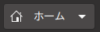

<!-- title:turnup readme -->    
<!-- style:./test.css -->			
<!-- config:term-link-in-header -->			
<!-- config:header-numbering 2 4 -->			
<!-- css is from http://jasonm23.github.io/markdown-css-themes/markdown.css -->


# README - turnup

　この文書は、**turnup**（仮名）のためのマニュアル文書です。
    
				
<!--
  multi
  line
  comment
  test
 -->


## Table of contents

<!-- embed:toc 2 4 -->
　

## turnup とは

　turnup は、Markdown 書法で作成したテキストファイルから HTML を出力するツールです
{{fn:turnupという名前は、mark down を mark up にひっくり返す(turn upする)という意味で付けられました。}}。
このマニュアル文書自体、turnup で作成されています。


## 用語

*[GFM]: GitHub Flavored Markdown というものの略語だそうです。turnup は可能な範囲で
サポートするように心掛けています。

*[Markdown]: マークダウンと読みます。HTML の Mark up をしないで済むという意図なんで
しょうけど、命名にセンスが‥‥‥ね。

*[HTML]: Hyper text markup language の略語です。


## 使い方

　入力となるファイルの名前をパラメータとして起動してください。生成された HTML は標準出力
に書き出されるので、必要に応じてリダイレクトしてください。

<raw_html>
<pre>
  turnup.exe  input.md  >  output.htm
</pre>
</raw_html>

　入出力ファイルのエンコーディングは utf-8 で固定となっています。それ以外のエンコーディング
への対応は現状では予定されていません。


## 記法

　turnup の入力書式は、基本的には一般的な Markdown 書法と同じですが、いくつかの拡張
機能を備えています。{{fn:`GitHub Flavored` なんたらとか色々あるみたいで、細かいことを言い出すと混乱しそうですが。}}

### 見出し

　行頭から１〜６個の # を記述し、続けて（半角）スペースをひとつ書いた行は見出し行になります。
後続する文字列が見出しのタイトルとなります。# の数に応じて h1 〜 h6 になります。

<raw_html>
<pre>
 # header1
 ## header2
 ### header3
 #### header4
 ##### header5
 ###### header6
</pre>
</raw_html>


### 箇条書きリスト

　-（ハイフン）、+（プラス）、または *（アスタリスク）にスペースを後続させると、箇条書きリストになります。
ネストさせたい場合は、行頭にタブ文字を使用してください。

- List A
+ List B
	* List B - 1
	- List B - 2
		+ List B - 2 - 1
		* List B - 2 - 2
- List C
+ List D


　また、- などの先頭記号とスペースに続けて [ ] や [X] を記述すると、チェックボックス付きリストになります。

- Task 1
	- [X] completed task
	- [ ] not completed task
- Task 2
	- [X] completed task
		* point 1
		* point 2


### 番号付きリスト

　数字にピリオドとスペースを後続させると、番号付きリストになります。ネストさせたい場合は、
行頭にタブ文字を使用してください。

1. List A
1. List B
	1. List B - 1
	1. List B - 2
		1. List B - 2 - 1
		1. List B - 2 - 2
1. List C
1. List D

### preブロック

　バッククォート3つ、またはチルダ3つだけからなる行で囲まれたブロックは <pre> ブロックとなります。
{{fn:スペースまたはタブで始まる行を pre ブロックとする仕様は採用していません}}

```
int main( void ) {
    std::cout << "hello world." << std::endl;
    return 0;
}
```

~~~
int main( void ) {
    std::cout << "hello world." << std::endl;
    return 0;
}
~~~

### テーブル

　※まだ記述されていません。

	| header A | header B | header C |	
	|:---------|:--------:|---------:|	
	|     0    |     1    |    2     |	
	|     3    |     4    |    5     |	
	|     6    |     7    |    8     |	


### 引用

　行頭を > で始めると引用になります。複数の > 連続させると多段の引用になります。
{{fn:現在の実装では > は行頭から始める必要があり、また複数の > の間に空白を入れることはできません。これは課題として将来修正される可能性があります。}}

> lv.1 - 1
> lv.1 - 2
>> lv.2 - 1
>> lv.2 - 2
>>> lv.3
> lv.1
>>>> lv.4
>> lv.2

### 定義リスト

　以下のような記述により、定義リストを作成できます。turnup では、これによって定義された
用語は[自動リンク](#定義リストへの自動リンク)の対象となります。

<raw_html>
<pre>
  *[用語]: 用語の定義をここに記述します。
  複数行に渡る定義も記述できます。空行で終わります。

</pre>
</raw_html>

### 強調

### 取消し線

### マーカー

　== を使って括ることで、マーカーを利用することができます。スタイルシート次第です
が、==例えばこんなふう==になります。

<raw_html>
<pre>
  ==例えばこんなふう==になります。
</pre>
</raw_html>


### 上付きと下付き

### リンク

　文章中で以下のような書き方をすることで、URL へのリンクを貼ることができます。
{{fn:GFN だと URL を単純に書いただけでもリンクになるようですが、そこまではしてません。}}

<raw_html>
<pre>
  [テキスト](URL)
</pre>
</raw_html>

### コード

　文章中では、以下のようにバッククォートで括ることで、囲まれた部分をコードとして表示させられます。
この内部にある文字列は、用語の自動リンクやその他の文字装飾は実行されません。

<raw_html>
<pre>
  `code`
</pre>
</raw_html>

### 水平線

　行頭からハイフン、等号、アンダースコア、アスタリスクを３個以上を記述すると水平線として出力
されます。文字種は混在させないでください。

### 画像の挿入

　画像を表示させるには、以下のように記述します。独立した行として記述することもできますし、
文章中にインラインで挿入させることもできます。

<raw_html>
<pre>
  
</pre>
</raw_html>


## 拡張機能

　turnup には、いくつかの拡張機能があります。一般的な Markdown の書法からは逸脱しますが、
文書作成に必要と判断して追加しているものです。

### 文書タイトルとスタイルシートの指定

　データファイルの冒頭に以下のようなコメントを記述することで、出力される HTML ファイルのヘッダに
設定するタイトルとスタイルシートを指定することができます。

<raw_html>
<pre>
  &lt;!-- title:Document title --&gt;
  &lt;!-- style:./default.css --&gt;
</pre>
</raw_html>

### 生の HTML の出力

　以下のように記述することで、生の HTML をそのまま出力することができます。

<raw_html>
<pre>
  &lt;raw_html&gt;
      :
      :
  &lt;/raw_html&gt;
</pre>
</raw_html>

### 脚注

　※まだ記述されていません。

<raw_html>
<pre>
  {{fn:}}
</pre>
</raw_html>

<raw_html>
<pre>
  &lt;!-- embed:footnotes --&gt;
</pre>
</raw_html>

### 目次の生成

　見出し情報から目次を生成することができます。以下のように記述すると、その場所に階層化
されたリストの形式で目次が作成されます。

<raw_html>
<pre>
  &lt;!-- embed:toc --&gt;
</pre>
</raw_html>

　目次の作成対象となる見出しレベルを絞ることもできます。以下のように記述すると、h2 から 
h4 までが対象となります。

<raw_html>
<pre>
  &lt;!-- embed:toc 2 4 --&gt;
</pre>
</raw_html>

### 定義リストへの自動リンク

　[定義リスト](#定義リスト)をつかって用語を定義すると、文章中に登場したその用語は自動的に
定義箇所へのリンクになります。このマニュアル文書では、「[](#用語)」というセクションで
いくつかの用語を定義しているので、たとえば Markdown という用語は自動的にリンクされます。

　なお、この自動リンクにおいて、大文字小文字が異なる表記は対象になりません。この挙動を
変更するオプションは今のところ、ありません。

　　

## テストのコーナー（あと Markdown が自動リンクされるかどうか）

　文字エスケープのテストです。例えば、< とか > とか & とか < とか > とか & は正しく
出力されていますか？

　code のテストです。例えば、`uint32_t val = 666;` は正しく出力されていますか？　続いて、
単独のバッククォート ` を書いてみます。出力されました？
    
　取消線のテストです。例えば~~この部分は取消されて~~いますか？　続いて、単独のチルダ ~ や終端
しない２連続のチルダ ~~ を書いてみます。出力されました？
    
　では、コードを含む取消しはできるでしょうか。~~この `template <typename C> class Foo` は取消されて~~いますか？

　忘れてはならないのは、md ファイル上で複数行で記述されているパラグラフ内で、行を跨ったかたちで
コードや取消線の指定はできないということです。

　次へいきましょう。*アスタリスク１つで括ると em タグによる強調*になります。_アンダースコア１つでも同じ_です。
これを**２つにすると strong による強調**になります。__アンダースコアでも同じ__です。
さらに***３つにすると em と strong を両方使い***ます。___アンダースコアでも同じ___です。

　~~**強調したものを取消し**~~たり、**~~取消したものを強調し~~**たり。

　続いてリンクです。これは [googleへのリンク](https://www.google.co.jp/)です。
ラベルを省略すると ⇒ [](https://www.google.co.jp/)

　見出しへのページ内リンク。[これは目次へ](#Table of contents)。あるいは、[](#記法)。

　マーカーのテスト。==この部分です==。いかがでしょう。

　sup と sub。H~2~O とか、2^10^ = 1024 とか。

　用語展開のテストです。Markdown は展開されて欲しいし、TM とか、HTML とか、markdown は？

　以下は画像  埋め込みのテストです。


--------------------------------------------------------------------------------

<!-- embed:footnotes -->
